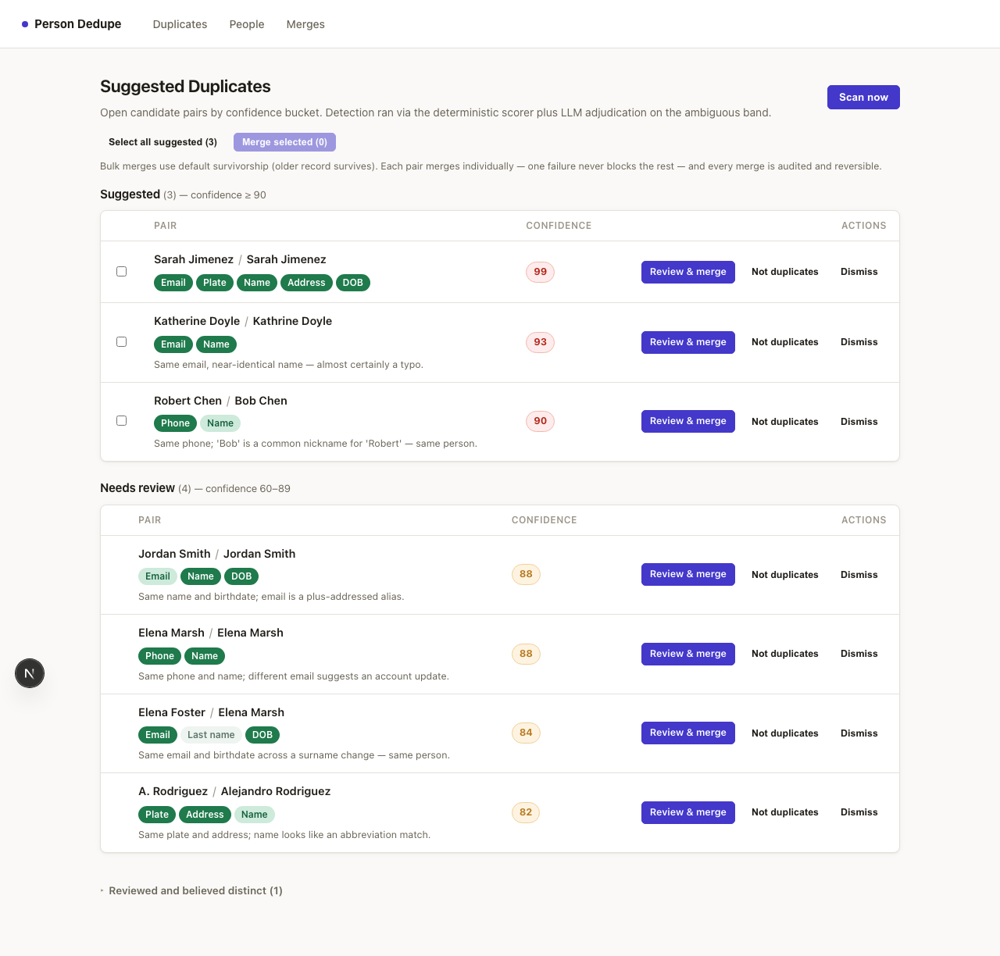
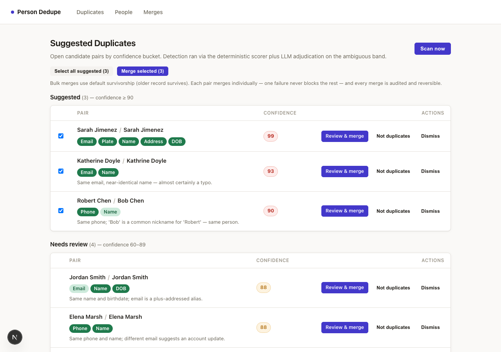
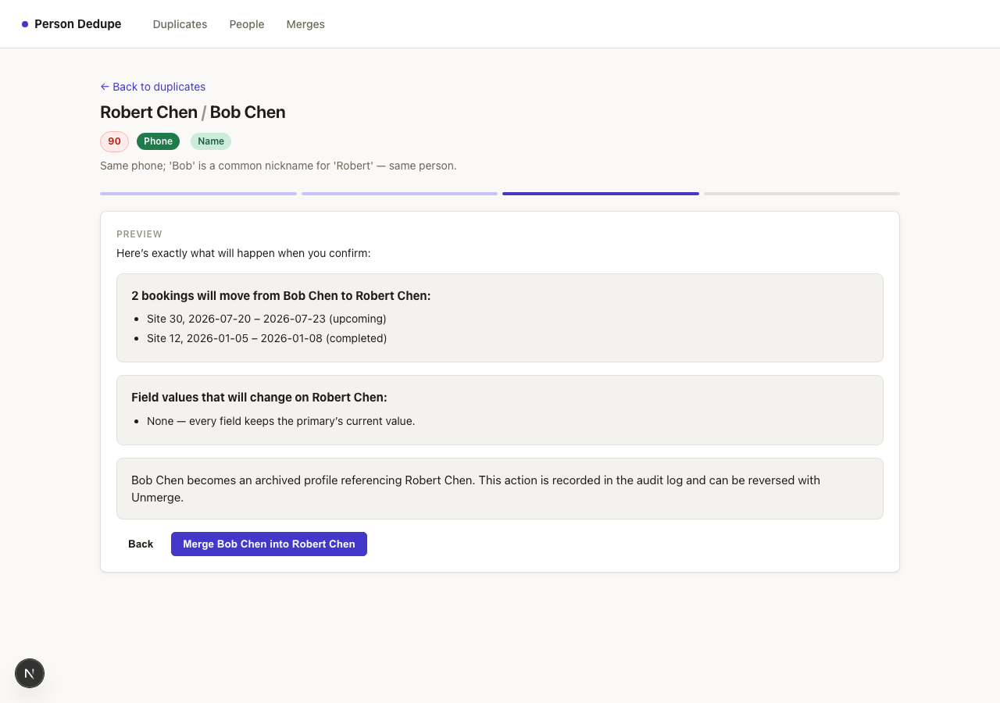
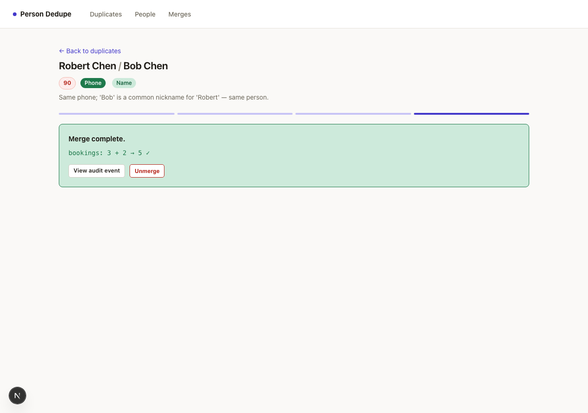

# person-dedupe-prototype

Reference implementation: duplicate person-record **detection, review, and
merge** for an admin app with customer profiles + transactional child records.

Built as a public, self-contained tracer bullet — read `SPEC.md` first; it is
the contract this code implements and the document to port from.

## Run it

```sh
npm install
npm run seed     # creates SQLite db with ~24 engineered demo records
npm run dev      # http://localhost:3000
```

Zero external services. Works with no API key (pre-recorded LLM
adjudications for the seeded data). Set `OPENROUTER_API_KEY` (+ optionally
`LLM_MODEL`) to exercise the live adjudication path.

## The 90-second demo

1. **/duplicates** — candidate pairs grouped into confidence buckets
   (Suggested ≥90 / Needs review 60–89 / low-confidence), matching fields
   highlighted by signal strength; the spouse case sitting in "believed
   distinct" at confidence 12 (the system explains what it did NOT flag).
2. Open the Robert Chen pair → compare view → choose primary → resolve the
   phone conflict → preview (bookings that will move) → **merge**.
3. Verification panel: booking counts conserved, moved records intact,
   audit event linked. Hit **Unmerge** and watch it come back.
4. **Bulk**: back on the report, "Select all suggested" → **Merge selected**
   — each pair merges individually (older record survives), one failure never
   blocks the rest, every merge audited and reversible.
5. **/people/new** — type a seeded email; the inline duplicate warning fires.

## What it looks like

**The report** — grouped by confidence bucket, field signals rendered as
chips (saturated = strong match, faint = weak, struck-through =
counter-signal). Expand "Reviewed and believed distinct" to see the
Marcus/Danielle Webb spouse case sitting at confidence 12 — the system
explaining what it declined to flag (shared email + address, but different
first names *and* birthdates).



**Bulk deduplication** — select all suggested pairs and merge the batch in
one action; each merges individually through the same engine, with per-pair
results.



**Merge preview** — every consequence of the merge stated before it happens:
which bookings move, which field values change, and that the action is
reversible.



**Post-merge verification** — booking counts conserved (3 + 2 → 5 ✓), a link
to the audit event, and Unmerge right there.


